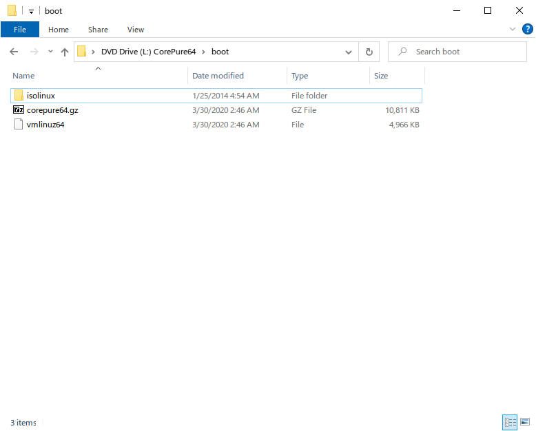
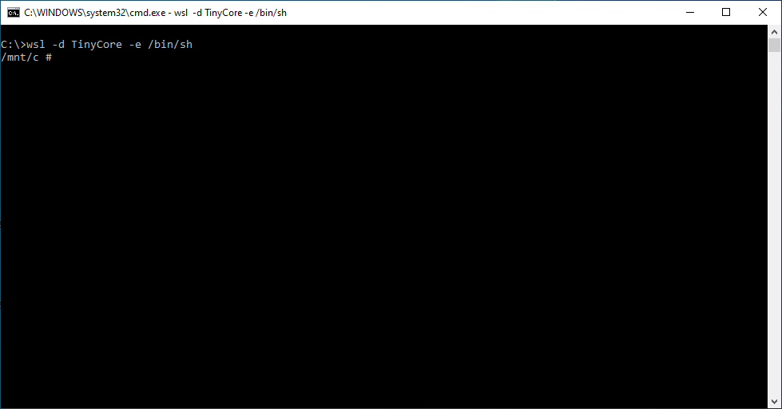
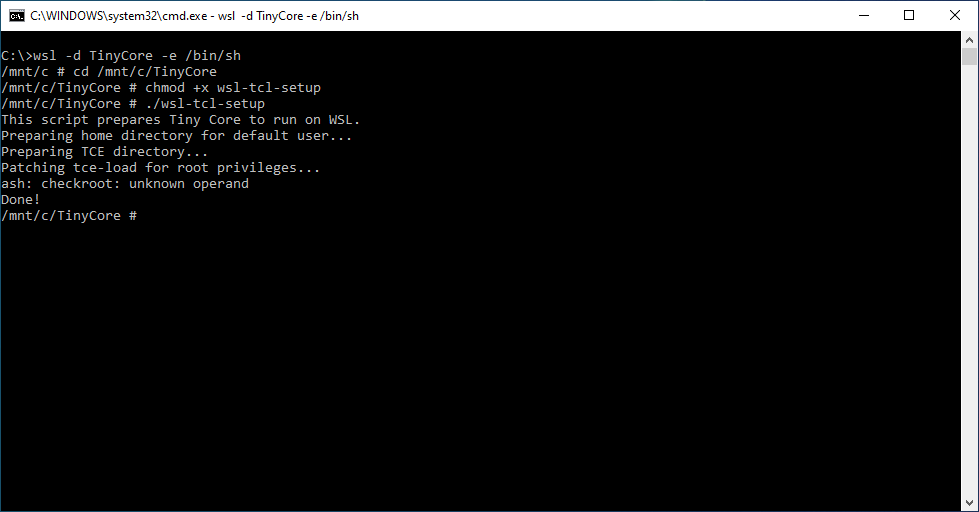
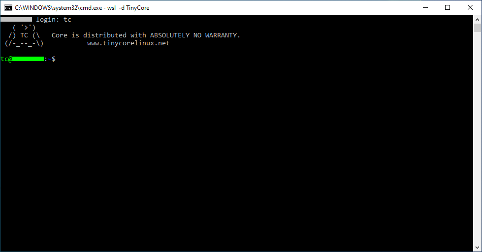
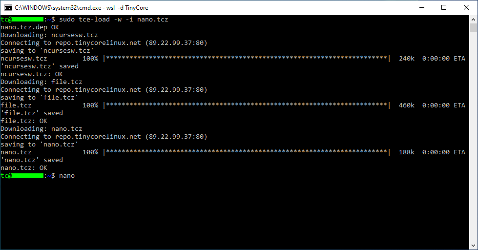
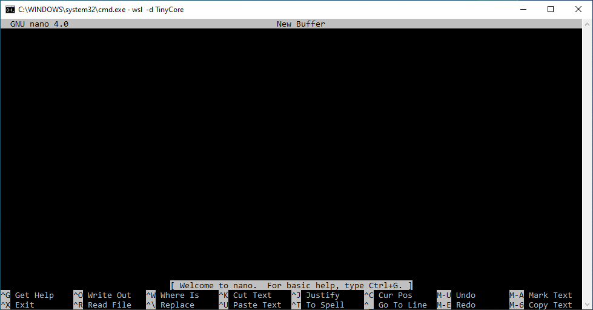

# wsl-tcl-setup
 A script that allows Tiny Core Linux to run on WSL 2.

## Intro
[Tiny Core Linux](http://www.tinycorelinux.net/) is a GNU/Linux distro where the root filesystem and software packages (called "extensions"/.tcz's) are stored as compressed files on the boot device. Once booted, the entire OS runs from RAM. In order to support this, Tiny Core uses a variation of the Linux kernel that takes parameters such as from where to load extensions, on which drive the home directory is located, etc. These parameters are passed to the kernel/OS by the bootloader, e.g. GRUB.

Since the Windows Subsystem for Linux (WSL) doesn't use a bootloader in order to run GNU/Linux distros within Windows, and since Tiny Core began development long before WSL was a figment of Microsoft's imagination, it doesn't work very well out of the box. For instance, you can't install any extensions since the extensions directory is missing. The home directory for the default user, tc, is also missing. This script creates the missing directories, then patches tce-load (the program that downloads/installs extensions) to require root privileges rather than denying root the ability to use it. This is necessary since the default extensions directory can only be written to by root.

## Usage
### Installing Tiny Core
First, you will need to install Tiny Core as a WSL distro. Download the latest Tiny Core .iso image for x86_64 (avaialable [here](http://www.tinycorelinux.net/)). Mount it using File Explorer, then navigate into the "boot" folder.


We're interested here in corepure64.gz. Inside it there is a cpio archive which contains the entire OS except for the kernel, which WSL will provide. That archive needs to be converted into tar format in order for it to be imported as a WSL distro, and we can't just do it using 7-Zip.

In order to convert the gzipped cpio archive into a .tar, we'll need another distro already installed in WSL, such as Debian, Ubuntu, SUSE etc. I've prepared a script called "cpiogz2tar" (available [here](https://github.com/zkedem/cpiogz2tar)) to perform the conversion in one go. The conversion will have to be done as root on a GNU/Linux filesystem (necessary to preserve ownership/permissions), so start by copying corepure64.gz into your existing distro:

```
$ pwd
/mnt/l/boot
$ cp corepure64.gz ~/
```
Download cpiogz2tar and make it executable:

```
$ wget https://raw.githubusercontent.com/zkedem/cpiogz2tar/master/cpiogz2tar`
$ chmod +x cpiogz2tar
```
Run cpiogz2tar as root:

```
$ sudo su
# ./cpiogz2tar corepure64.gz
# exit
```
Copy the resulting .tar back into Windows:

```
$ cp corepure64.tar /mnt/c
```
In the Command Prompt, use wsl.exe to install Tiny Core:

```
C:\>wsl.exe --import TinyCore C:\TinyCore corepure64.tar --version 2
```
The "--version 2" is important; this installs Tiny Core as a WSL 2 distro. Since WSL 2 uses virtualization + an actual Linux kernel, it allows Tiny Core to access features such as loop device support, which is needed for it to function properly.

### Setting up Tiny Core
Now we're ready to start up Tiny Core for the first time!

```
C:\>wsl -d TinyCore -e /bin/sh
```
This command tells Tiny Core to go straight into a root shell rather than the normal "bootup" process. We only need to do it this one time.


After a few seconds, the shell prompt will appear. Download wsl-tcl-setup into an appropriate folder (I'm using C:\\TinyCore) and change to it. Once you're there, make wsl-tcl-setup executable and run it:

```
# cd /mnt/c/TinyCore
# chmod +x wsl-tcl-setup
# ./wsl-tcl-setup
```

(Excuse the ash error in the screenshot; it was fixed before uploading)

You can at this point exit the root shell. Now back at the Command Prompt, type "wsl -d TinyCore" to start using Tiny Core for real. Because Tiny Core thinks it's running natively and not as a virtualized instance, it will display a login prompt once it's initialized. Just enter the username "tc" with no password:


Now you can install extensions!



## License
wsl-tcl-setup is free software released under the GNU GPL, version 3.